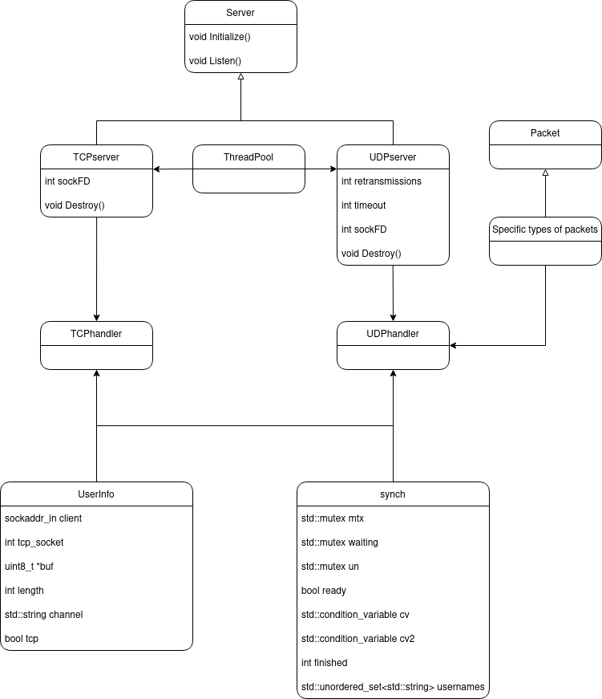
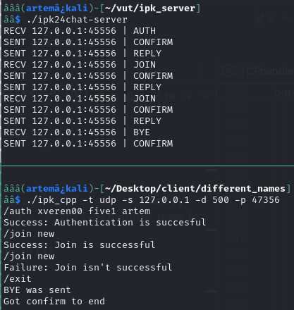
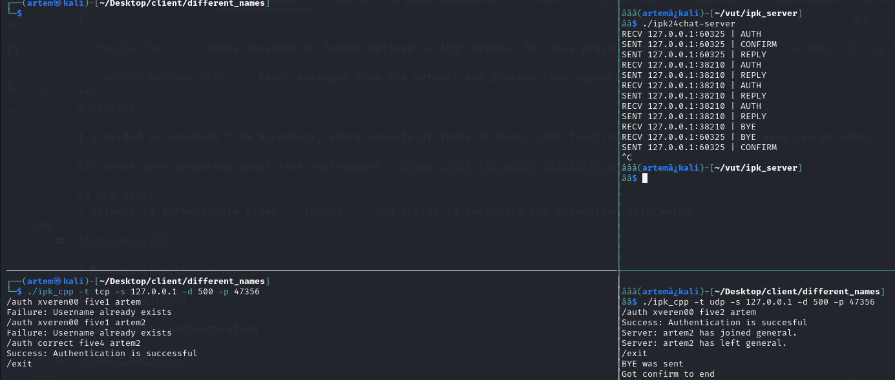
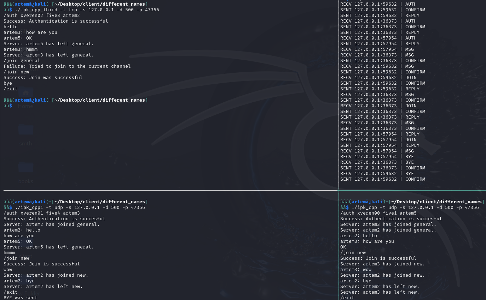

# IPK - second project - Server-chat

This is a simple chat application written in C++.

**Table of contents:**

- [IPK - first project - Client-chat](#ipk---first-project---client-chat)
    - [Theory](#theory)
    - [Implementation](#implementation)
        - [Overall logic](#overall-logic)
        - [Message broadcasting](#message-broadcasting)
        - [Packets](#packets-for-udp)
    - [Testing](#testing)
    - [Bibliography](#bibliography)

# Theory

- ### TCP

  Transmission Control Protocol is a transport protocol that is used on top of IP (Internet Protocol) to ensure reliable
  transmission of packets over the internet or other networks. TCP is a connection-oriented protocol, which means that
  it establishes and maintains a connection between the two parties until the data transfer is complete. TCP provides
  mechanisms to solve problems that arise from packet-based messaging, e.g. lost packets or out-of-order packets,
  duplicate packets, and corrupted packets. TCP achieves this by using sequence and acknowledgement numbers, checksums,
  flow control, error control, and congestion control.

- ### UDP

  User Datagram Protocol is a connectionless and unreliable protocol that provides a simple and efficient way to send
  and receive datagrams over an IP network. UDP does not guarantee delivery, order, or integrity of the data, but it
  minimizes the overhead and latency involved in transmitting data when compared to TCP. UDP is suitable for
  applications that require speed, simplicity, or real-time communication, such as streaming media, online gaming, voice
  over IP, or DNS queries.

- ### Thread Pool

  Thread pool is a software design pattern for achieving concurrency of execution in a computer program. Essentially, a
  thread pool is a group of pre-instantiated, idle threads which stand ready to be given work. These are preferred over
  instantiating new threads for each task when there is a large number of short tasks to be done rather than a small
  number of long ones. This prevents having to incur the overhead of creating a thread a large number of times.

***

# Implementation

## Overall logic

##### More detailed graphs can be found in doxy_doc, generated using Doxygen, on my repository



Program begins by parsing command line arguments.

```cpp
ArgumentsHandler ah{};
ah.get_args(argc, argv);
```

Then we initialize necessary values, and create instances of UDPserver and TCPserver.

```cpp
UDPserver udp{ah.get_retransmissions(), ah.get_timeout()};
TCPserver tcp{};
udp.Initialize(server_addr);
tcp.Initialize(server_addr);
```

Then we start to wait for incoming connections, creating two threads.

```cpp
std::thread tcpThread(&TCPserver::Listen, &tcp, &tp, &s, &synch_variables, pipefd[0]);
std::thread udpThread(&UDPserver::Listen, &udp, &tp, &s, &synch_variables, pipefd[0]);
```

Next, we set up ```epoll``` to listen on appropriate socket and on SIGINT signal.
When connection is accepted at UDP or TCP server, it adds a task to the thread pool queue(```TCPhandler::handleTCP```
or ```UDPhandler::handleUDP```), which will be communicating
with client afterward.

Then each client handler will listen to its client socket and behave accordingly to the ```IPK24-CHAT protocol```.

## Message broadcasting

Each handler creates its own thread which listens to shared stack of user packet
information ```std::stack<UserInfo> *s```.
To synchronise all threads ```struct synch``` is used. It contains different mutexes, conditional variables and
booleans.
When we want to broadcast the message, we add to the stack new ```UserInfo``` struct and notify all threads. Each thread
checks, that message wasn't sent from its parent thread, and send the message to its client.

```
void UDPhandler::message(uint8_t *buf, int message_length, std::stack<UserInfo> *s, synch *synch_var,std::string &channel) 
void TCPhandler::message(uint8_t *buf, int message_length, std::stack<UserInfo> *s, synch *synch_var, std::string &channel)
```

## Packets for UDP

Packet structures were used from IPK project1. Each struct inherits from ```struct Packets```. It
implements ```void construct_message``` which writes bytes to uint8_t buf, that will be sent afterward.
***
# Testing

I provided logs from terminal, where results of tests of basic chat functionality and some error cases can be seen.
Client used is from IPK project 1.

All tests were conducted under this environment - https://git.fit.vutbr.cz/NESFIT/dev-envs.git?dir=ipk#c

* Attempt to join current channel



* Attempt to authenticate under existing username 



* Common communication process



## Bibliography

* Ing. Daniel Dolejška, Ing. Vladimír Veselý Ph.D., IPK lectures, [04.07.2024]
* A. S. Tanenbaum, "Computer Networks," 5th ed., Pearson, 2011, [04.15.2024]
* GeeksforGeeks. (n.d.). different articles [04.08.2024]; URL: https://www.geeksforgeeks.org/
* E. Bendersky. (2017) Concurrent servers [04.10.2024]; URL: https://eli.thegreenplace.net/2017/concurrent-servers-part-1-introduction/